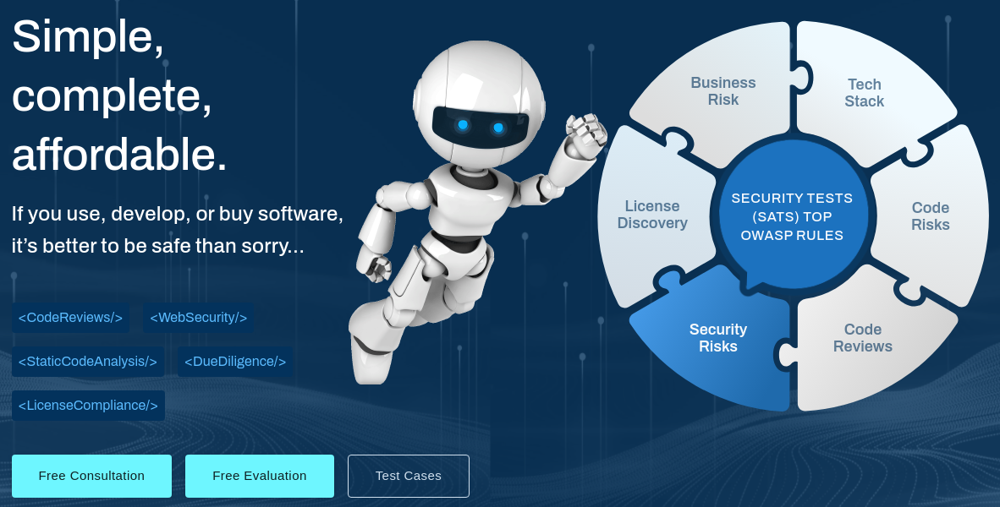
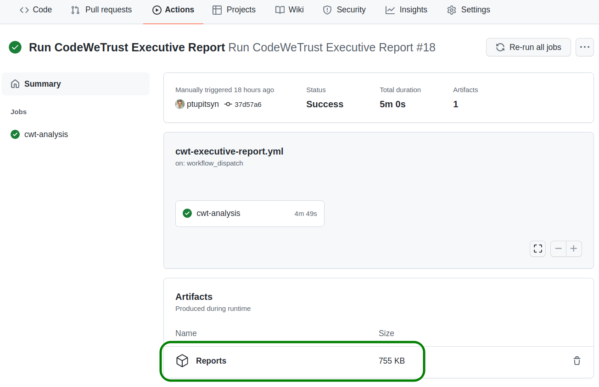

# Scan your code with CodeWeTrust

Perform source code analysis with [CodeWeTrust](https://codewetrust.com) scanner and generate Executive Report in pptx format.



CodeWeTrust provides an innovative solution to evaluate and analyze software products.

It performs multi-stage code analysis and provides an aggregated report:

* Tech Stack
* Code Risks
* Static Code Analysis
* Security Review
* License Compliance
* Contributors Overview
* Business Risks

All popular programming languages are supported (JavaScript, Python, Java, C#, C++, Rust, Go, etc).

## Requirements

* A CodeWeTrust account - sign up for free on [codewetrust.com](https://codewetrust.com)

## Usage Example

1. Obtain your CodeWeTrust license key. **Keep it secret - don't commit to Git**. Store it in **GitHub Settings -> Secrets -> Actions**.

2. Set up a GitHub workflow - a yaml file in `.github/workflows` directory in the root of your repository.

```yaml
name: Run CodeWeTrust Executive Report

on: workflow_dispatch

jobs:
  cwt-analysis:
    runs-on: ubuntu-20.04

    steps:
    - name: Checkout
      uses: actions/checkout@v2
      with:
        fetch-depth: 0 # avoid shallow clone so that Git history analysis works

    - name: CodeWeTrust Analysis
      uses: Source-Code-Inspection-inc/CodeWeTrust-GitHubAction-ExecutiveReport@v0.13
      with:
        licenseKey: ${{ secrets.CWT_LICENSE_KEY }}

    - name: Upload Report
      uses: actions/upload-artifact@v2
      with:
        name: Reports
        path: ExecutiveReport.pptx
```

3. Go to **Actions** pane in your GitHub repository and trigger the workflow.
4. Get Executive Report from action run artifacts. 


